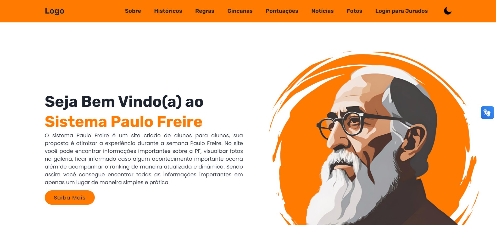

# Trabalho de conclusão de curso - Sistema Paulo Freire ou SPF

Bem-vindo(a) ao **TCC SPF**!, aqui você irá encontrar um trabalho de conclusão de curso feito durante o 3º ano do ensino médio integrado ao técnico em informática para internet
da Escola Técnica Estadual de Campo Limpo Paulista (ETECAMP), 

Grupo do Trabalho:
Vinicius Kum
Nycollas Feriotto Dias
Mateus Araujo da Silva

Orientadores:
Thaynara Andrade
Barbara porphirio

## Como começamos e qual nosso objetivo: ☕️

Nas Escolas Técnicas Estaduais DE São Paulo, sempre temos projetos diferenciados para incentivar o aluno durante o ano, propondo novas habilidades, colegas, união de classe e diferentes sistemas de
ensino, que juntos formam um bom profissional! Uma dessas ginganas, se chama **Semana Paulo Freire**, uma semana de ginganas, teatros, palestras, aprendizados, pesquisas, artes, danças, competições,
canto e muitas outras atrações, onde comemoramos o dia de nosso querido educador e filosofo Brasileiro, **Paulo Freire (1921-1997)**, patrono da educação brasileira, que ensinou ao mundo como uma escola
pode mudar vidas, caminhos e seu ensino deve ser uma sala de debates e conversas multiplas entre o aluno e o professor, que não sabe de tudo e sim compartilha o conhecimento concebido em seus estudos 
diarios.

Nesta semana temos competições por pontos em gincanas e outras brincadeiras que sempre incluem o querido Paulo Freire no meio da história, sendo assim, cada sala, ao compeltar uma parte da competição
recebe uma quantidade de pontos que vem de jurados de fora da escola, para que os pontos não fiquem inviesados, assim, todos temos garra para participar e competir olhando para nossa educação, colegas 
e o mais importante, diferentes jeitos de aprendizado!

Porém, com a aplicação de entrevistas e questionários, foi notado que muitas das pesssoas tinham duvidas durante a semana, a tabela de pontos era dificil e demorado para ser gerada, a memoria dos vencedores
constantemente ficava para trás! e as noticias de certa forma não chegavam a maioria dos destino por meio de whatsapp então sentiu-se a nescessidade de construir uma sistema digital completo para facilitar a 
contagem de pontos, geração de gráficos, divulgaçaão de noticias, "sala de trofeús digital" e outras áreas de interesse dos docentes e alunos.

## Algumas imagens para demonstrar o site: 🎞️

###  Linguagens usadas no website: 🖥️
- HTML Versão 5
- CSS Versão 3
- PHP Versão 8.1.30
- JAVASCRIPT Versão ECMAScript 2023

-> EXTENSÕES/PACOTES:

- PhpMailer Versão 6.9.1
- PSR-4_Autoloader
- SimpleXLXSGEN
- DomPDF
- Composer
- AltoRouter
- GEOIP2-php
- PHPLOT
- PHPOFFICE
- Maxmind geolite2

###  Linguagens usadas no aplicativo: 📱

- HTML Versão 5
- CSS Versão 3
- Node.js Versão 20.17
- NPM Versão 10.8.3
- Ionic Versão 7.2

-> EXTENSÕES/PACOTES:

- Firebase Versão 13.19.0
- Chart Versão 4.4.4

###  Linguagens usadas no dedurator: 🕹️

- C++ no Arduino IDE Versão 2.3.3

## Etapas para término do processo de construção do Artigo: ✔️

- Definição do tema, defesa de tema e pesquisa de viabilidade.
- Pesquisa de campo e entrevistas.
- Prototipos, design, começo do manual da marca.
- Manual da marca e criação visual.
- Criação do website e aplicativo.
- Construção do ssistema eletronico para competições com botões.
- Teste de campo do site e acessibilidade do mesmo.
- Apresentação do TCC à banca.
- Apresentação do TCC na feira tecnologica.
- Implementação na ETECAMP.
- Manutenção do sistema.

###  Como citar este trabalho: ⌨️🖱️

DA SILVA, Matheus Araújo; DIAS, Nycollas Feriotto;KUM, Vinicius. Desenvolvimento de um sistema web para auxiliar na organização da semana Paulo freire. 2024. 30 p.

Copyright @ 2024 Todos os direitos reservados aos autores.
