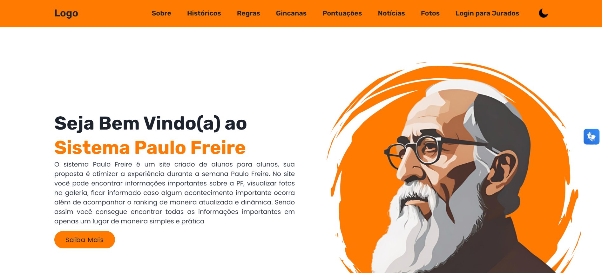
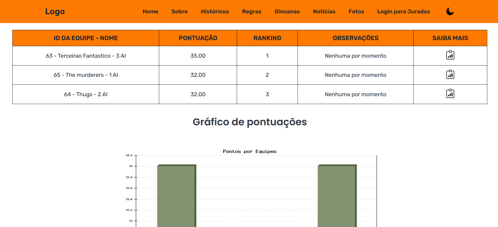
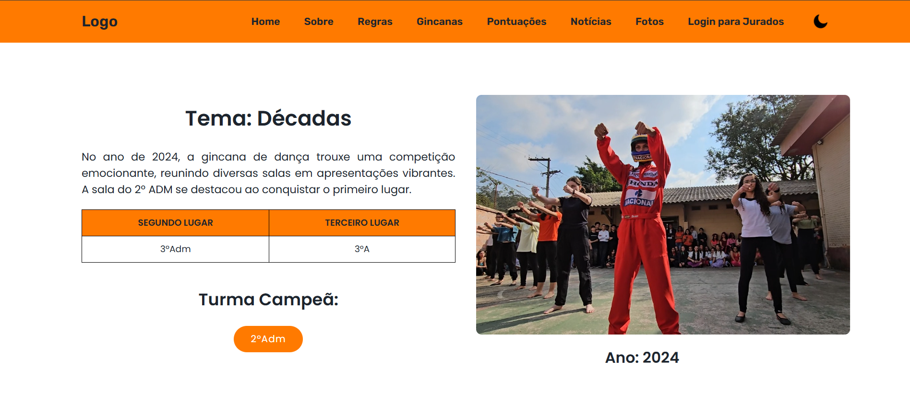
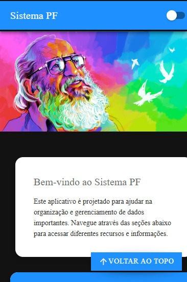
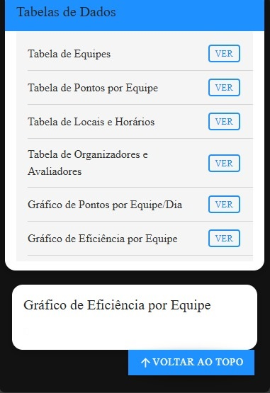
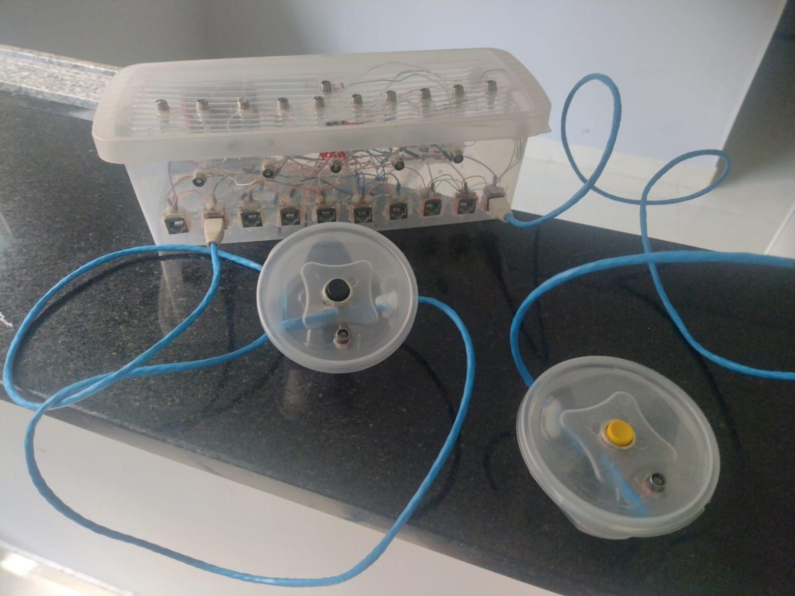
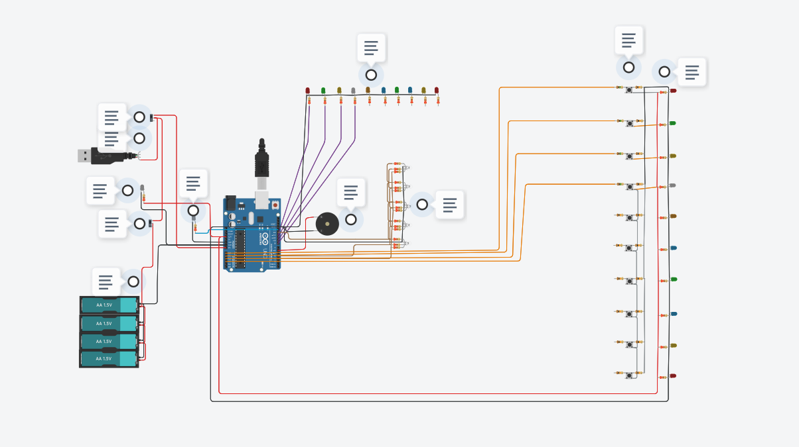

# Trabalho de conclusão de curso - Sistema Paulo Freire ou SPF

Bem-vindo(a) ao **TCC SPF**!, aqui você irá encontrar um trabalho de conclusão de curso feito durante o 3º ano do ensino médio integrado ao técnico em informática para internet
da Escola Técnica Estadual de Campo Limpo Paulista (ETECAMP), 

Grupo do Trabalho:
Vinicius Kum,
Nycollas Feriotto Dias e
Mateus Araujo da Silva.

Orientadores:
Thaynara Andrade e
Barbara Porfirio.

## Como começamos e qual nosso objetivo: ☕️

Nas Escolas Técnicas Estaduais DE São Paulo, sempre temos projetos diferenciados para incentivar o aluno durante o ano, propondo novas habilidades, colegas, união de classe e diferentes sistemas de
ensino, que juntos formam um bom profissional! Uma dessas ginganas, se chama **Semana Paulo Freire**, uma semana de ginganas, teatros, palestras, aprendizados, pesquisas, artes, danças, competições,
canto e muitas outras atrações, onde comemoramos o dia de nosso querido educador e filosofo Brasileiro, **Paulo Freire (1921-1997)**, patrono da educação brasileira, que ensinou ao mundo como uma escola
pode mudar vidas, caminhos e seu ensino deve ser uma sala de debates e conversas multiplas entre o aluno e o professor, que não sabe de tudo e sim compartilha o conhecimento concebido em seus estudos 
diarios.

Nesta semana temos competições por pontos em gincanas e outras brincadeiras que sempre incluem o querido Paulo Freire no meio da história, sendo assim, cada sala, ao completar uma parte da competição
recebe uma quantidade de pontos que vem de jurados de fora da escola, para que os pontos não fiquem inviesados, assim, todos temos garra para participar e competir olhando para nossa educação, colegas 
e o mais importante, diferentes jeitos de aprendizado!

Porém, com a aplicação de entrevistas e questionários, foi notado que muitas das pesssoas tinham duvidas durante a semana, a tabela de pontos era dificil e demorado para ser gerada, a memoria dos vencedores
constantemente ficava para trás! e as noticias de certa forma não chegavam a maioria dos destino por meio de whatsapp então sentiu-se a nescessidade de construir uma sistema digital completo para facilitar a 
contagem de pontos, geração de gráficos, divulgaçaão de noticias, "sala de trofeús digital" e outras áreas de interesse dos docentes e alunos.

## Algumas imagens para demonstrar o site: 🎞️

###  Linguagens usadas no website: 🖥️
- HTML Versão 5
- CSS Versão 3
- PHP Versão 8.1.30
- JAVASCRIPT Versão ECMAScript 2023

Por conta do tamanho e da complexidade de carregar as extensões do site, preferimos relatar as versões e pedir
ao usuário que baixasse e colocasse-as na pasta extensions para facilitar a execução do site.

-> EXTENSÕES/PACOTES:

- PhpMailer Versão 6.9.1
- PSR-4_Autoloader
- SimpleXLXSGEN
- DomPDF
- Composer
- AltoRouter
- GEOIP2-php
- PHPLOT
- PHPOFFICE
- Maxmind geolite2

###  Linguagens usadas no aplicativo: 📱

- HTML Versão 5
- CSS Versão 3
- Node.js Versão 20.17
- NPM Versão 10.8.3
- Ionic Versão 7.2

-> EXTENSÕES/PACOTES:

- Firebase Versão 13.19.0
- ng2-charts
- Chart Versão 4.4.4

###  Linguagens usadas no dedurator: 🕹️

- C++ no Arduino IDE Versão 2.3.3

## Etapas para término do processo de construção do Artigo: ✔️

- Definição do tema, defesa de tema e pesquisa de viabilidade.
- Pesquisa de campo e entrevistas.
- Prototipos, design, começo do manual da marca.
- Manual da marca e criação visual.
- Criação do website e aplicativo.
- Construção do ssistema eletronico para competições com botões.
- Teste de campo do site e acessibilidade do mesmo.
- Apresentação do TCC à banca.
- Apresentação do TCC na feira tecnologica.
- Implementação na ETECAMP.
- Manutenção do sistema.

## Como executar esse trabalho: 🧰

###  Executando o website: 🖥️

Instalar as dependencias e aplicaitivos

1 - Entre no link a seguir para baixar o Visual Studio Code: https://code.visualstudio.com/
(Baixa o pacote base para seu sistema e siga os passos de instalação)

2 - Entre no link para instalar o xampp: https://www.apachefriends.org/pt_br/download.html
(Baixa o pacote base para seu sistema e siga os passos de instalação)

Carregar a base de dados e configurar o email do website

1 - Entre no seu explorar de arquivos, vá em este computador, entre em seu hd principal, entre em xampp, entre em htdocs, baixe o arquivo do website spf e descompacte ele aqui dentro. 

2 - Abra o seu control panel do xampp e ative o MySQL e Apache, clique em admin do MySQL.

3 - Após abrir o phpmyadmin em seu navegador, clique em +novo, em nome do banco de dados coloque bd_spf, clique em criar, vá na aba de importar, escolher um arquivo e agora
vá ate seu htdocs novamente, entre na pasta do spf.com, backend -> conexao -> sql -> bd_spf -> bd_spf.sql e pronto!

4 - Após abrir o phpmyadmin em seu navegador, clique em +novo, em nome do banco de dados coloque bd_logs_spf, clique em criar, vá na aba de importar, escolher um arquivo e agora
vá ate seu htdocs novamente, entre na pasta do spf.com, backend -> conexao -> sql -> bd_logs_spf -> bd_logs_spf.sql e pronto!

5 - Abra o visual studio code, clique em arquivo, clique em abrir pasta, procure pela pasta do spf.com no seu htdocs, abra ela, entre em backend -> form_p_adm -> invite_email.php -> troque as linhas 
119, 120, 121 e 123 do codigo por seu email, nome do remetente, identificador do remetente, senha, email do destinatario e nome do destinatario nesta ordem.

6 - Entre em backend -> perfil_usuarios -> alterar_perfil.php -> troque as linhas 514, 515, 516, por seu email, senha, nome do remetente e identificador do remetente nesta ordem.

7 - Por conta do tamanho e da complexidade de carregar as extensões do site, preferimos relatar as versões e pedir
ao usuário que baixasse e colocasse-as na pasta extensions para facilitar a execução do site.

-> EXTENSÕES/PACOTES à baixar e colocar na pasta de extensions:

- PhpMailer Versão 6.9.1
- PSR-4_Autoloader
- SimpleXLXSGEN
- DomPDF
- Composer
- AltoRouter
- GEOIP2-php
- PHPLOT
- PHPOFFICE
- Maxmind geolite2

Iniciar o site e abrir ele no navegador

1 - Abra o navegador de sua preferencia, e digite na barra de pesquisa: 

http://localhost/spf.com
ou 
http://<seu_ip>/spf.com

###  Executando o aplicativo: 📱

IMPORTANTE: Fazer o passo de instalação do site (O aplicativo funciona conectado no site), ou seja, instalar XAMPP, Visual Studio Code. Colocar site no LocalHost gerado pelo Xampp, conectar Banco de Dados, etc.

Instalação dependências específicas do Aplicativo

1 - Instalar Node e npm na URL: https://nodejs.org/pt/download/package-manager
2 - Instalar Ionic na URL: https://ionicframework.com/docs/intro/cli

Alterações para funcionamento

3 - Dentro do Visual Studio Code, abra o terminal integrado e crie um projeto ionic em branco com os seguintes comando:

ionic start meupp

Nessa instrução, caso desejemos omitir o parâmetro template, por padrão será utilizado o template tabs. No entanto, se quisermos escolher um modelo pré-definido de aplicação, podemos informar, nesse argumento, um dos seguintes valores:

Templates iniciais nomeados:
tabs 
sidemenu;
blank. (Escolha esse!);

4 - Instale o chart.js na pasta do aplicativo seguindo os passos do site: https://www.chartjs.org/

5 - Após abrir um projeto em branco, baixe o a pasta do app_spf, descompacte, copie o src inteiro e cole dentro do projeto ionic que você acabou de abrir, substaituindo o src antigo.

6 - Abrir Visual Studio Code -> src/app/services/api.service.ts  -> Alterar para o IP da internet (O aplicativo roda utilizando o IP, que busca informações no site dentro do local host, e o site busca informações no Banco de Dados). Para saber o IP que está conectado o computador, digitar CMD na barra de pesquisa do Windows, e nele digitar "ipconfig". Utilizar o IP do "Endereço IPv4". e alterar na linha: "  private apiUrl = 'http://192.168.12.167/spf.com/backend/conexao/script/api.php';"
(O aplicativo depende das configurações e conteudos do website, sendo assim, o website é um pré requisito)

7 - Abrir terminal do Visual Studio Code, no CMD do terminal integrado digitar "ionic serve", vai abrir uma página no navegador.

###  Executando o sistema eletronico: 🕹️

Compre os materiais nescessários e construa o sistema: 

- 10x botoes de arcade.
- 12x metros de fio de rede.
- 11x leds de alto brilho com cores diferentes.
- 1x Caixinha para 4 pilhas.
- 1x Adptador de 12v para 3.3 ou 5 Volts.
- 1x esp 32 wroom.
- Jumpers diversos.
- 1x buzzer ativo.
- 5x leds RGB de 4 pinos ou 1 fita de 15cm RGB.
- 1x protoboard ou placa universal.
- 1x caixa de plastico de 10cm x 30cm no minimo para o sistema.
- 10x caixas de plastico de 10cm x 10cm no minimo para os botoes.
- 10x conectores BNC femea.
- 10x conectores BNC macho.
- 4x pilhas AA.
- 1x alavanca ou botão de ON/OFF de 2 polos.
- 10x resistores de 470 Ohms.
- 10x resistores de 1 K Ohm.
- 3x resistores de 510 ohms.
- 16x capas para led de 3mm.

Estimativa de preço com base nos preços de 2024 sem responsabilidades:
350,00 R$ 💵

Montagem do sistema:

1 - Corte os cabos de rede, dez cabos de 1 metro cada.

2 - Tire os pequenos fios que sobraram dos 2 metros de cabo de rede restantes.

4 - Pegue a maior caixa, instale como preferir os itens abaixo dentro dela, usando cola quente, super cola ou parafusos.
Esp 32 WROOM, Protoboard, 10 conectores BNC Femea, adaptor de energia de 12v para 3.3 ou 5 volts, buzzer, 10 leds para botoes, 1 led para memoria, 1 buzzer, 1 fita led ou 5 leds rgb de 4 pinos e 
a depender da quantidade de leds, instale as capas, lembrando que alguns itens serão instalados "saindo da caixa" e outros dentro da caixa, conforme ultima imagem dessa instrução!

5 - Pegue as 10 caixas para botoes, instale um botão em cada uma desas caixas, pegue os 10 pedaços de 1 metro de fio e solde um pedaco de 1 metro em cada um dos 10 kits caixa/botão, ao final da 
solda, instale um conector bnc macho em cada uma das pontas dos 10 kits botão/caixa/fio.

6 - Volte na caixa maior, solde um fio entre a caixa de pilhas e o botão ON/OFF.
7 - Solde um fio entre o botão ON/OFF e a entrada vin e gnd do esp 32 wroom.
8 - Solde um fio do buzer na saida do buzzer do esp.
9 - Solde um fio do led de memoria na saida do led de memoria do esp.
10 - Solde um fio do gnd do esp no gnd da fita led.
11 - Solde um fio de cada cor RGB da fita led, em cada saida RGB do esp.
12 - Solde um fio para cada 1 dos 10 leds dos botoes para um pino do esp.
13 - Solde um fio para cada 1 das 10 saidas dos botoes para um pino do esp.

Carregamento do sistema:

1 - Baixe o arduino IDE no link a seguir: https://www.arduino.cc/en/software
(Baixa o pacote base para seu sistema e siga os passos de instalação)

2 - Baixe o driver do esp 32 no link a seguir: 
CH340: https://sparks.gogo.co.nz/ch340.html?srsltid=AfmBOoppX-ReGhvhHV8y4dTSor9iT5ir7fm6aNigdJ5URheVdsjGk-Zg
CP210X: https://www.silabs.com/developer-tools/usb-to-uart-bridge-vcp-drivers

3 - Instale as preferencias e configurações do esp 32 no arduino ide: https://embarcados.com.br/como-programar-o-esp32-na-arduino-ide/

4 - abra o codigo do dedurator no arduino ide, conecte a placa no esp 32, verifique se esta tudo correto e carregue o programa.

Uso do sistema:

1 - Inicie o sistema atraves da chave ON/OFF, e aguarde a musica de inicio acabar! Pronto, agora é só iniciar o jogo e o sistema sempre ira dedurar quem apertou primeiro o botão de resposta!

##  Como citar este trabalho: ⌨️🖱️

DA SILVA, Matheus Araújo; DIAS, Nycollas Feriotto; KUM, Vinicius. Desenvolvimento de um sistema web para auxiliar na organização da semana Paulo freire. 2024. 35 p.

### Em caso de duvidas entre em contato com codnicius@gmail.com ou com feriottodias@gmail.com

#### Copyright @ 2024 Todos os direitos reservados aos autores.
